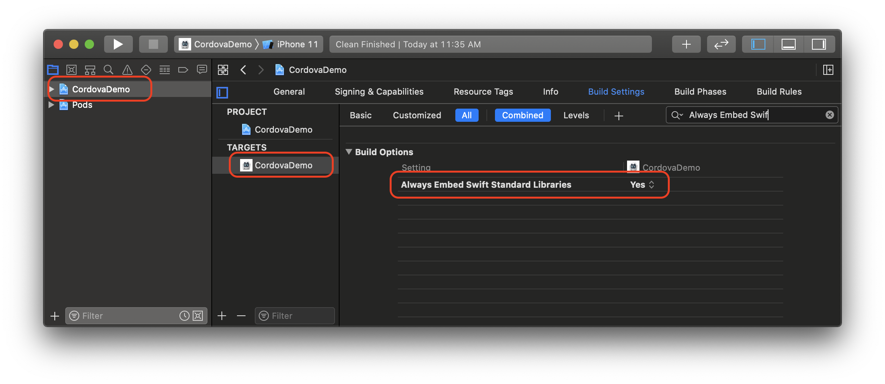
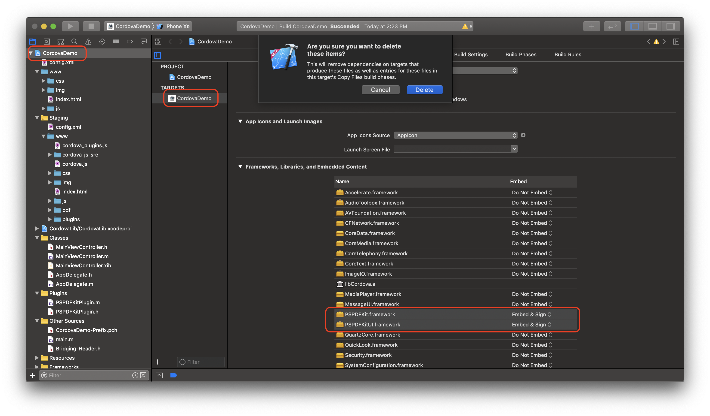

# Cordova Plugin for PSPDFKit 9 for iOS

The [PSPDFKit SDK](https://pspdfkit.com/pdf-sdk/) is a framework that allows you to view, annotate, sign, and fill PDF forms on iOS, Android, Windows, macOS, and Web.

PSPDFKit comes with open source plugins for Cordova on both [iOS](https://pspdfkit.com/guides/ios/current/other-languages/apache-cordova-phonegap/) and [Android](https://pspdfkit.com/guides/android/current/other-languages/apache-cordova-phonegap/).

## Requirements

- Xcode 11.5 or later
- PSPDFKit 9.5.0 for iOS or later
- Cordova Lib >= 9.0.0
- Cordova iOS >= 5.1.1
- CocoaPods >= 1.9.3

## Installation

We assume that you have [an existing Cordova project](https://cordova.apache.org/#getstarted).

1. Run `cordova plugin add https://github.com/PSPDFKit/PSPDFKit-Cordova.git` to install the `pspdfkit-cordova` plugin.
2. Update your `Podfile`: `cd platforms/ios` and open your `Podfile` in a text editor. Make sure the platform is set to iOS 12 or later. Your `Podfile` should look like this:

```diff
source 'https://github.com/CocoaPods/Specs.git'
- platform :ios, '10.0'
+ platform :ios, '12.0'
use_frameworks!
target 'CordovaDemo' do
	project 'CordovaDemo.xcodeproj'
	pod 'PSPDFKit', podspec: 'https://customers.pspdfkit.com/pspdfkit-ios/latest.podspec'
end
```

3. If your application is targeting iOS versions **prior to iOS 12.2** and your application **does not already contain any Swift code**, then you need to make sure Xcode bundles Swift standard libraries with your application distribution. To to so, open your target Build Settings and enable `Always Embed Swift Standard Libraries`:



4. Install the Pods: run `pod install`.

## Usage

The plugin is accessed via the PSPDFKit singleton. Here are some example calls:

```javascript
// Set your license key here.
PSPDFKit.setLicenseKey("YOUR KEY");

// Show pdf with in single page mode, with a black background.
PSPDFKit.present("pdf/document.pdf", {
  pageMode: "single",
  backgroundColor: "black"
});

// Show a PDF document with a callback.
PSPDFKit.present("pdf/document.pdf", function() {
  alert("pdf has appeared");
});

// Scroll to page 1.
PSPDFKit.setPage(1, true);

// Get the page number.
PSPDFKit.getPage(function(page) {
  alert("Current page: " + page);
});
```

## Getting Started

#### New Cordova Project

Let's create a simple Corodva app that integrates PSPDFKit and uses the `pspdfkit-cordova` plugin.

1. Run `cordova create Cordova-Demo com.pspdfkit.demo CordovaDemo` to create a new Cordova project.
2. Add a sample PDF into your `www` directory: `www/pdf/document.pdf`.
3. Modify the `onDeviceReady` function in `www/js/index.js` like so:

```javascript
onDeviceReady: function() {
  this.receivedEvent('deviceready');
  // Set your license key here.
  PSPDFKit.setLicenseKey("YOUR KEY");

  // Show pdf with in single page mode.
  PSPDFKit.present('pdf/document.pdf', {
    pageMode: 'single',
  });
},
```

4. `cd` into `Cordova-Demo` and run `cordova plugin add https://github.com/PSPDFKit/PSPDFKit-Cordova.git` to install the `pspdfkit-cordova` plugin.
5. Open `config.xml` and change the deployment target to iOS 12 or later:

```diff
<platform name="ios">
	<allow-intent href="itms:*" />
	<allow-intent href="itms-apps:*" />
+	<preference name="deployment-target" value="12.0" />
</platform>
```

6. Run `cordova platform add ios` to add the iOS platform.
7. If your application is targeting iOS versions **prior to iOS 12.2** and your application **does not already contain any Swift code**, then you need to make sure Xcode bundles Swift standard libraries with your application distribution. To to so, open your target Build Settings and enable `Always Embed Swift Standard Libraries`:


8. Run the app: Open `platforms/ios/CordovaDemo.xcworkspace` in Xcode, then build and run, or run `cordova emulate ios` in the Terminal.

#### New Ionic Project

Let's create a simple Ionic app that integrates PSPDFKit and uses the `pspdfkit-cordova` plugin.

1. Run `ionic start IonicDemo blank --type=angular` to create a new Ionic project.
2. `cd` into `IonicDemo` and run `ionic cordova plugin add https://github.com/PSPDFKit/PSPDFKit-Cordova.git` to install the `pspdfkit-cordova` plugin.
3. Open `config.xml` and change the deployment target to iOS 12 or later:

```diff
<platform name="ios">
	<allow-intent href="itms:*" />
	<allow-intent href="itms-apps:*" />
+ 	<allow-navigation href="*" />
+	<preference name="deployment-target" value="12.0" />
</platform>
```

4. Declare `PSPDFKit` in `src/declarations.d.ts` (create this file first): `declare var PSPDFKit: any;`
5. Modifying `src/app/app.component.ts` to use the PSPDFKit plugin to Present a PDF:

```javascript
initializeApp() {
  this.platform.ready().then(() => {
    this.statusBar.styleDefault();
    this.splashScreen.hide();
    
    PSPDFKit.setLicenseKey('YOUR KEY');
    PSPDFKit.present('pdf/document.pdf', {});
  });
}
```

6. Run `ionic cordova platform add ios` to add the iOS platform.
7. Run `ionic cordova prepare ios` to prepare iOS platform.
8. If your application is targeting iOS versions **prior to iOS 12.2** and your application **does not already contain any Swift code**, then you need to make sure Xcode bundles Swift standard libraries with your application distribution. To to so, open your target Build Settings and enable `Always Embed Swift Standard Libraries`:


9. Add a sample PDF into your `platforms/ios/www` directory: `platforms/ios/www/pdf/document.pdf`.
10. Run the app: Open `platforms/ios/MyApp.xcworkspace` in Xcode, then build and run, or run `ionic cordova emulate ios` in the Terminal.

## API

You can find the API documentation in [PSPDFKit.js](../../www/PSPDFKit.js).

## Troubleshooting

### Problem:

```sh
Error: Cannot find plugin.xml for plugin "PSPDFKit-Cordova". Please try adding it again.
```

### Solution:

Run `cordova plugin add https://github.com/PSPDFKit/PSPDFKit-Cordova.git` instead of `ionic cordova plugin add https://github.com/PSPDFKit/PSPDFKit-Cordova.git`.

## Migration Guide from `Cordova-iOS`

If you were using the old [Cordova-iOS Plugin](https://github.com/PSPDFKit/Cordova-iOS), please follow the steps below to migrate to this plugin:

1. Remove the old plugin: `cordova plugin remove pspdfkit-cordova-ios`
2. Open your Xcode project or workspace and remove `PSPDFKit.framework` and `PSPDFKitUI.framework` from your Target:



3. Close your Xcode project or workspace.
4. Integrate the new `pspdfkit-cordova` Plugin. See the [Install](#installation) instructions above.
5. Rename all `PSPDFKitPlugin` calls to `PSPDFKit` in your app's JavaScript code:

```diff
- PSPDFKitPlugin.setLicenseKey("YOUR KEY");
+ PSPDFKit.setLicenseKey("YOUR KEY");

- PSPDFKitPlugin.present('pdf/document.pdf', {
+ PSPDFKit.present('pdf/document.pdf', {
  pageMode: 'single',
});
```
